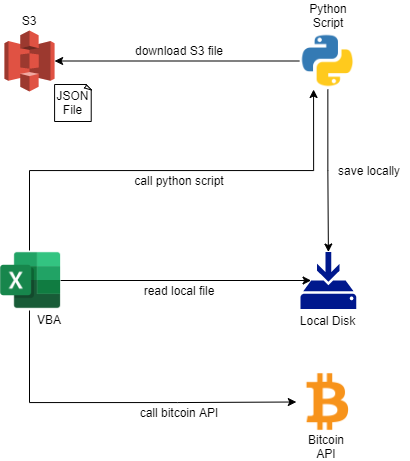

# S3 file download with Python and access with VBA

This simple project is using the following stacks:

- Python
- AWS S3
- VBA/Excel
- A Bitcoin API

With this stacks, we will the Python script to download a JSON file from
S3 with boto3, and save it locally.

The Excel with VBA will call this Python script to perform this download, and after this the VBA will read the local JSON file.

And finally the VBA will call an external API to get Bitcoin current bid, the API is from https://bitpreco.com/api

To parse JSON on VBA we will be using a library called VBA-JSON from https://github.com/VBA-tools/VBA-JSON

## Architecture

